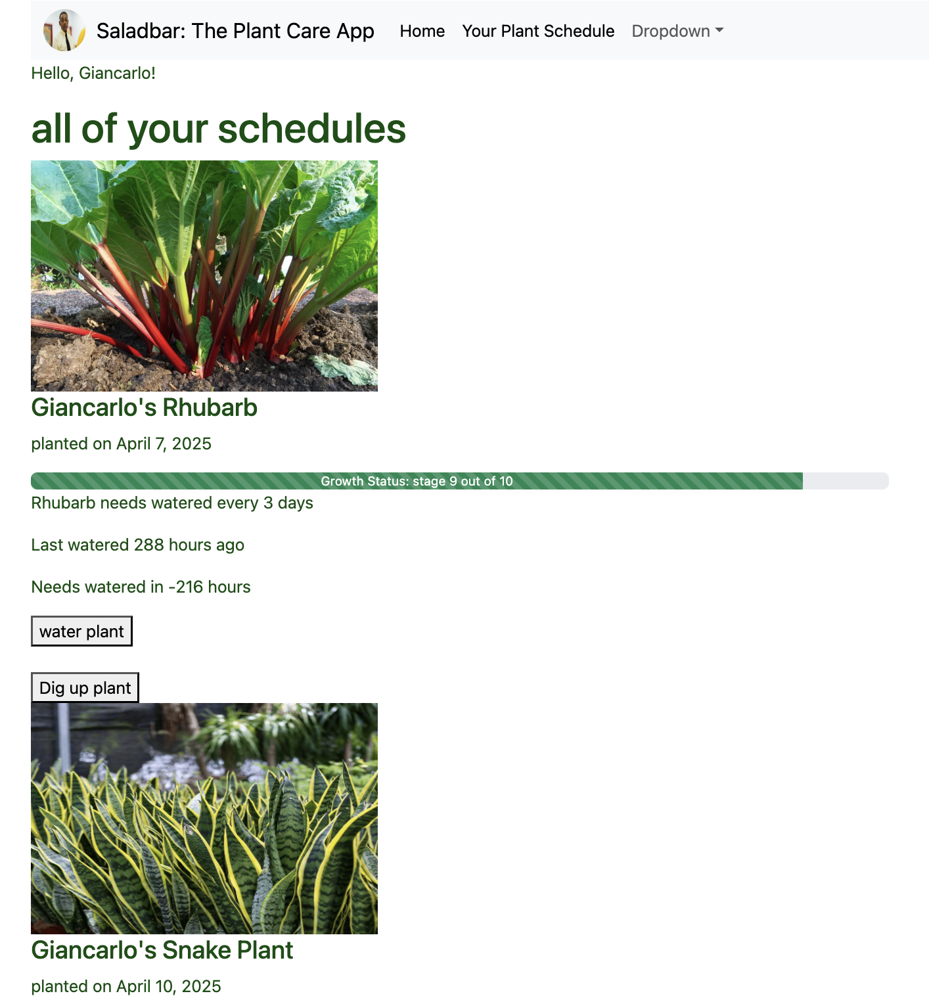
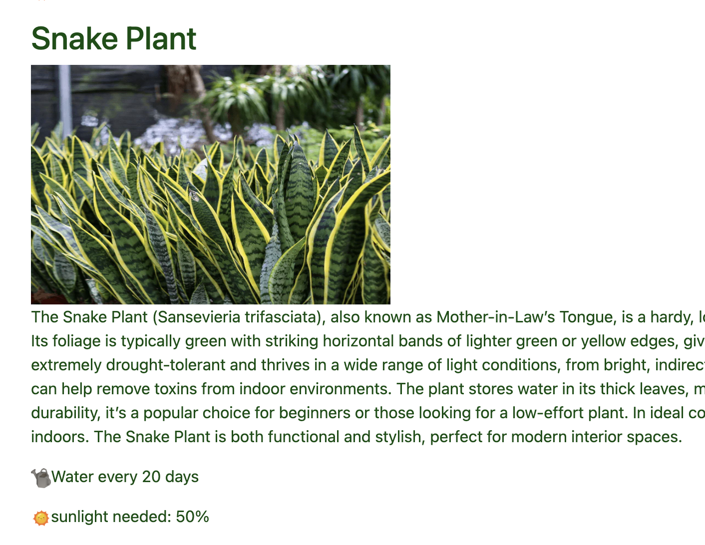

# 🥗 Saladbar: The Plant Care App

**Saladbar** is a plant care simulator inspired by farming games, but with a more realistic twist. Users can create instances of plants, water them at specific intervals, and track their growth progress over time. The app also tracks how many of each plant type a user has successfully grown or currently has in progress.

---

## 🌱 Features

- 🌿 Create and grow digital plants from a curated selection
- 💧 Water plants at required intervals to keep them alive and growing
- 📊 Track growth stages and plant-care progress
- 📈 View how many of each plant type you've grown and currently have growing
- 🔐 User authentication and login system

---

## 🛠 Tech Stack

| Layer         | Technology        |
| ------------- | ----------------- |
| **Frontend**  | React, Bootstrap  |
| **Backend**   | Ruby on Rails     |
| **Database**  | PostgreSQL        |
| **Auth**      | Built-in with Rails |

---

## 🚀 Getting Started

### Prerequisites
- Node.js
- Ruby & Rails
- PostgreSQL

### Setup

1. **Clone the repository**  
   ```bash
   git clone https://github.com/nathanielpierson/plant-capstone-app.git
   cd plant-capstone-app
   ```

2. **Backend setup**  
   ```bash
   cd backend
   bundle install
   rails db:create db:migrate db:seed
   rails s
   ```

3. **Clone the frontend repository**
   ```bash
   git clone https://github.com/nathanielpierson/plant-capstone-frontend
   cd plant-capstone-frontend

3. **Frontend setup**  
   ```bash
   cd frontend
   npm install
   npm start
   ```

> Make sure the backend is running on `localhost:3000` and the frontend is configured to communicate with it.

---

## 🖼 Screenshots

### 📅 Plant Schedule View
Displays all of a user's currently growing plants, their growth stages, and watering needs.



### 🌿 Plant Detail View
Shows detailed information about a plant type, including its description, water needs, and sunlight requirements.



---

## 🎯 Future Plans

- 🧟 Plants will decay or "go bad" if neglected (not watered for too long)
- 🏆 Add achievement/reward system for growing certain quantities of plant types
- 📱 Mobile responsiveness and push notifications
- 🎨 More plant types and customization options

---

## 👨‍💻 About the Developer

**Nathaniel Pierson**  
Full-stack developer and Actualize bootcamp graduate.  
[LinkedIn](https://www.linkedin.com/in/nathanielpierson) | [Portfolio](kale-polygon-bht3.squarespace.com)
